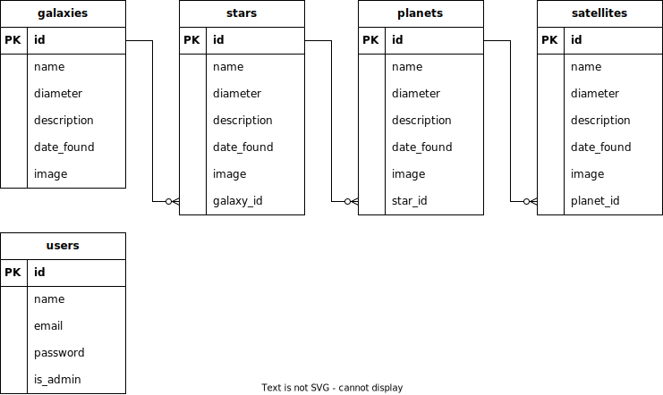

# Stellarships

Bosan di Bumi? Ayo jelajahi ruang angkasa tak terbatas dengan Stellarships!

> Stellarships adalah aplikasi penjelajahan ruang angkasa fiksi yang dibuat sebagai referensi project full stack development dengan tech stack Express-MariaDB-React.

> Project ini masih dalam pengembangan.

## Fitur

Untuk **Awak** (`crew`):

- Pilih perjalanan

Untuk **Kapten** (`captain`):

- Jalankan misi
- Rencanakan perjalanan sendiri
  - Pilih tujuan (galaksi -> sistem -> planet / satelit)
  - Pilih tanggal dan waktu keberangkatan
  - Pilih pesawat

Untuk **Laksamana** (`admiral`):

- Kelola misi

Untuk **Admin** (`admin`):

- Kelola galaksi
- Kelola bintang
- Kelola planet
- Kelola satelit
- Kelola pesawat
- Kelola pengguna

Semua pengguna:

- Edit profil

## Diagram ER

## Tech stack

- Frontend: React
- Backend: Express
- Basis data: MariaDB
